# GitHub AI Stats

**Show your AI coding DNA on your GitHub profile.**

Dynamically generated AI usage stats card for your GitHub profile README. Automatically tracks your Claude Code & Codex CLI usage from local data — no API key required.

<p align="center">
  
</p>

---

## Features

- **Zero Config** — `npx github-readme-ai-stats init` 한 줄로 설정 완료
- **자동 업데이트** — Claude Code 종료 시 Stop hook이 자동으로 Gist 업데이트
- **로컬 데이터 기반** — `~/.claude/` 로컬 파일에서 직접 파싱, API 키 불필요
- **Top 3 Models** — 가장 많이 쓴 모델 3개를 자동 분석하여 표시
- **Multiple Providers** — Claude Code, Codex CLI 동시 지원
- **10 Themes** — dark, radical, tokyonight, dracula, neon, matrix, synthwave 등
- **Animated SVG** — 게이지바 애니메이션, 랭크 링, 글로우 이펙트
- **GitHub README 호환** — GitHub SVG 렌더러에서 동작하는 SMIL 애니메이션
- **Badges** — 개별 도구 배지 커스터마이즈

## Card Examples

### Claude Code User

<p align="center">
  
  
</p>

### Codex CLI User

<p align="center">
  
  
</p>

### Both Claude + Codex

<p align="center">
  
  
</p>

## Quick Start

### 방법 1: 자동 설정 (추천)

```bash
npx github-readme-ai-stats init
```

이 한 줄이 수행하는 작업:
1. `gh` CLI 인증 확인
2. `~/.claude/` 로컬 데이터 파싱 (토큰, 세션, 모델별 사용량)
3. SVG 카드 생성 → GitHub Gist에 업로드
4. Claude Code Stop hook 자동 등록 (이후 세션 종료마다 자동 업데이트)
5. README에 붙일 이미지 URL 출력

> **필요 조건:** [gh CLI](https://cli.github.com/) 설치 + `gh auth login` 인증

설정 완료 후 출력되는 코드를 프로필 README에 붙여넣으면 끝입니다:

```markdown

```

### 방법 2: 수동 설정

<details>
<summary>직접 Gist를 만들어서 설정하기</summary>

1. `npm run preview` 로 로컬 데이터 기반 SVG 카드 생성
2. `preview/card-{theme}.svg` 파일을 [gist.github.com](https://gist.github.com)에 업로드
3. Gist의 raw URL을 프로필 README에 추가

```markdown

```

수동 업데이트: `npm run preview` → Gist 재업로드

</details>

<details>
<summary>조직 계정: Admin API 자동 연동</summary>

조직(Organization) 계정이 있다면 Admin API Key를 사용할 수도 있습니다.

| Provider | Admin Keys | 필요 권한 |
|----------|-----------|----------|
| Anthropic | [platform.claude.com/settings/admin-keys](https://platform.claude.com/settings/admin-keys) | 조직 admin |
| OpenAI | [platform.openai.com/settings/organization/admin-keys](https://platform.openai.com/settings/organization/admin-keys) | 조직 Owner |

> 개인 계정에서는 Admin Keys가 제공되지 않습니다.

</details>

## How It Works

```
npx github-readme-ai-stats init (최초 1회)
  │
  ├─ ~/.claude/stats-cache.json 파싱 (모델별 토큰, 세션 수)
  ├─ ~/.claude/usage-data/session-meta/*.json 파싱 (커밋, 코드 라인)
  ├─ ~/.codex/sessions/ 파싱 (Codex 사용 시)
  │
  ├─ SVG 카드 생성 → GitHub Gist 업로드
  └─ Claude Code Stop hook 자동 등록
        │
        └─ 이후 Claude Code 종료마다 자동 실행
             → 데이터 재파싱 → Gist 업데이트
```

### 데이터 소스

| 소스 | 경로 | 수집 항목 |
|------|------|----------|
| Claude Code stats-cache | `~/.claude/stats-cache.json` | 모델별 토큰, 세션 수, 일별 활동 |
| Claude Code session-meta | `~/.claude/usage-data/session-meta/*.json` | git 커밋, 코드 라인, 파일 수정 |
| Claude Code JSONL | `~/.claude/projects/**/*.jsonl` | 상세 세션 로그 (fallback) |
| Codex CLI | `~/.codex/sessions/**/*.jsonl` | 모델별 토큰, 요청 수 |

> 참고: [ccusage](https://github.com/ryoppippi/ccusage) (11.8K stars), [cc-proficiency](https://github.com/Z-M-Huang/cc-proficiency) 등 검증된 오픈소스 프로젝트들이 동일한 로컬 파일을 데이터 소스로 사용합니다.

## Themes

| Theme | Preview |
|-------|---------|
| `default` |  |
| `dark` |  |
| `radical` |  |
| `tokyonight` |  |
| `dracula` |  |
| `neon` |  |
| `synthwave` |  |
| `gruvbox` |  |
| `nord` |  |
| `matrix` |  |

## Badges

코드를 복사하고 `usage=` 뒤의 텍스트만 원하는 대로 수정하세요:

<p>
  
  
  
  
</p>

```markdown


```

`usage=` 뒤의 값만 바꾸면 됩니다. 공백은 `%20`으로 인코딩합니다.

사용 가능한 도구: `claude-code`, `codex`, `claude`, `chatgpt`, `github-copilot`, `cursor`, `gemini`, `windsurf`

## Local Development

```bash
git clone https://github.com/kwakseongjae/github-readme-ai-stats.git
cd github-readme-ai-stats

# 로컬 Claude Code 데이터 기반 프리뷰
npm run preview

# 로컬 API 서버
npm run dev
# http://localhost:3000

# Gist 동기화 (수동)
npm run sync

# 초기 설정
npm run init
```

## Tech Stack

| Layer | Technology |
|-------|-----------|
| CLI | Node.js (init, sync, preview) |
| SVG | Pure SVG templates + SMIL animations |
| Data | Local file parsing (`~/.claude/`, `~/.codex/`) |
| Sync | GitHub Gist via `gh` CLI |
| Auto-update | Claude Code Stop hook |
| Icons | Simple Icons (SVG) + custom PNG (Claude Code, Codex) |

## Contributing

Contributions welcome! Some ideas:

- GitHub Action으로 주기적 Gist 동기화
- 더 많은 AI 도구 지원 (Gemini, Cursor, Windsurf)
- 새로운 테마
- 활동 히트맵, 언어 분석 등 카드 변형

## License

MIT
